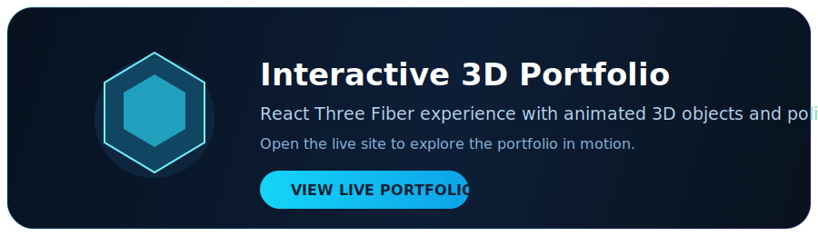

<h1 align="center">Sarthak Khatpe</h1>

  

  

  

  
  
  
  

  

---

## Profile Snapshot

- Java Full Stack Developer focused on Spring Boot and React
- Building modern web apps, AI features, and scalable backend systems
- Currently learning Cloud Native Development and production-grade architecture
- Open to internships, freelance work, and real-world product collaboration

---

## 3D Portfolio Experience

  

  

---

## Tech Stack

  

---

## Featured Projects

- AI Resume Builder using Spring Boot, React, and AI features
- Real-time Chat App with WebSocket and STOMP
- URL Shortener with JWT and Spring Security
- Plant Care System with Hibernate and MySQL

More projects: [github.com/sarthak425](https://github.com/sarthak425)

---

## Connect

  
  
  

---

## Current Focus

- Creating polished full-stack applications with clean UI and strong backend design
- Improving cloud, deployment, and containerization skills
- Expanding my portfolio with interactive 3D experiences and recruiter-friendly presentation

---

## GitHub Stats

  
  

---

## Streak Stats

  

---

## Contribution Snake

  

---

## Quote

> "First, solve the problem. Then, write the code."
