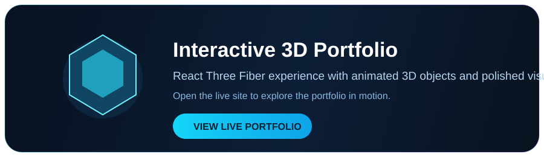

<h1 align="center">Hi 👋, I'm Sarthak Khatpe</h1>

  

  

  
  
  
  

  

---

<table align="center">
  <tr>
    <td width="60%">
      <h2>🚀 About Me</h2>
      
I am a passionate <b>Full Stack Java Developer</b> and <b>AI Enthusiast</b> dedicated to building modern, scalable, and intelligent web applications. I bridge the gap between robust backend architectures (Java, Spring Boot) and dynamic, interactive frontends (React), while integrating cutting-edge Artificial Intelligence and Machine Learning models to solve real-world problems.

      <ul>
        <li>🔭 <b>Current Focus:</b> Creating production-grade full-stack applications with clean architectures and cloud-native practices.</li>
        <li>⚡ <b>Learning:</b> Advanced system design, containerization (Docker, Kubernetes), and deep learning.</li>
        <li>🤝 <b>Collaboration:</b> Open to internships, freelance projects, and collaborating on innovative software products.</li>
      </ul>
    </td>
    <td width="40%" align="center">
      
    </td>
  </tr>
</table>

---

## 🏆 GitHub Trophies

  

---

## 💻 Tech Stack

  <b>Languages & Core</b>  
  

  <b>Frontend & Backend</b>  
  

  <b>Tools & DevOps</b>  
  

  <b>🤖 AI & ML Technologies</b>  
  
  
  
  
  
  

---

## ⭐️ Featured Projects

Here is a curated showcase of my top projects, highlighting my technical skills and implementation standards.

| Project Name | Rating | Description | Tech Stack |
| :--- | :--- | :--- | :--- |
| **🌸 [FlowerSense AI](https://github.com/sarthak425/flowersense-ai)** | ⭐⭐⭐⭐⭐ | AI-powered plant disease detection and care system utilizing custom computer vision models to diagnose leaf conditions instantly. | Python, TensorFlow, Scikit-learn, Pandas, NumPy |
| **📄 [AI Resume Builder](https://github.com/sarthak425/ai-resume-builder)** | ⭐⭐⭐⭐⭐ | Generate fully customized, ATS-friendly resumes dynamically powered by LLMs through Spring AI. | Spring Boot, Spring AI, React, Tailwind CSS |
| **🤖 [AI Demo Hub](https://github.com/sarthak425/ai-demo-hub)** | ⭐⭐⭐⭐⭐ | A comprehensive interactive playground demonstrating Chat, Image Generation, and AI Recipe generation using Ollama and OpenAI. | Spring Boot, React, Spring AI, Ollama, OpenAI |
| **💬 [springboot-websocket-chat](https://github.com/sarthak425/springboot-websocket-chat)** | ⭐⭐⭐⭐ | Real-time scalable chat application utilizing WebSockets and STOMP messaging protocol. | Spring Boot, WebSocket, STOMP, React, Bootstrap |
| **🔗 [springboot-url-shortener](https://github.com/sarthak425/springboot-url-shortener)** | ⭐⭐⭐⭐ | Secure and performant URL shortening service with JWT authentication and granular redirection analytics. | Spring Boot, Spring Security, JWT, MySQL, React |
| **🌺 [Flora Wings Clone](https://github.com/sarthak425/florawings-clone)** | ⭐⭐⭐⭐ | An immersive, feature-rich web storefront and management portal inspired by Flora Wings. | React, Tailwind CSS, Node.js, MongoDB |

---

## 🌐 3D Portfolio Experience

Check out my interactive 3D web experience to view my projects, interactive timeline, and skills in a fully rendered virtual environment.

  

  

---

## 📈 GitHub Statistics

  
  

  

### 🐍 Contribution Activity

  

---

## 🤝 Connect with Me

Let's discuss full-stack development, AI/ML integrations, or exciting project opportunities.

  
  
  

---

  <i>"First, solve the problem. Then, write the code."</i>

