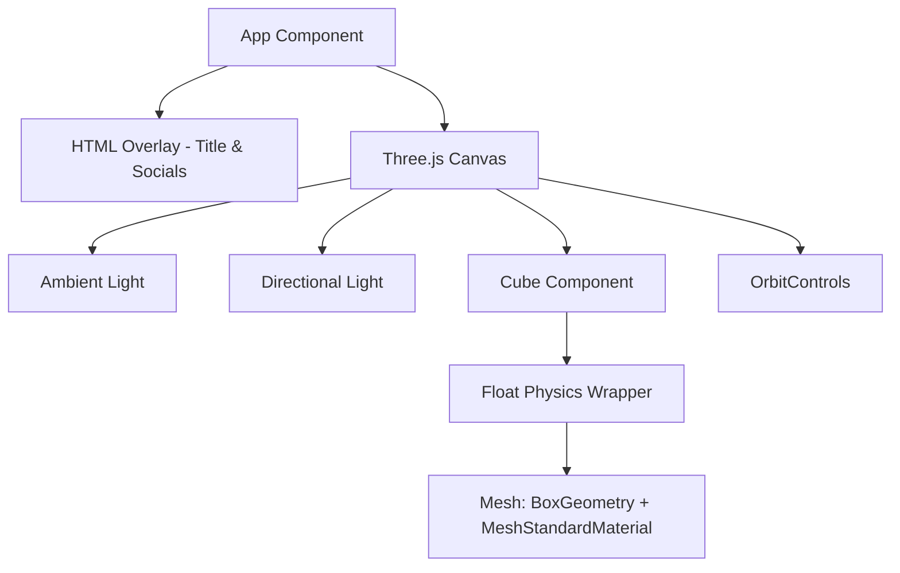

# 🌌 Personal 3D Portfolio Showcase

An immersive, web-based 3D portfolio showcase built using modern React, Vite, and WebGL technology via Three.js and React Three Fiber. This project serves as an interactive hub demonstrating creative 3D rendering, floating geometry, and responsive web design.

---

## 🚀 Features

- **Interactive 3D Scene:** Utilizes WebGL rendering to display floating 3D objects with realistic materials and lighting.
- **Dynamic Float Effects:** Implements smooth, mathematics-based floating and rotation physics using `@react-three/drei`.
- **Intuitive Camera Controls:** Supports OrbitControls allowing users to pan, rotate, and zoom the 3D scene effortlessly on both desktop and mobile devices.
- **Premium Aesthetics:** Dark-themed presentation (`#0f172a` slate) with high-contrast cyan (`#00ffff`) neon emissive-style 3D materials.
- **Fast HMR & Bundling:** Powered by Vite 8 and React 19 for instantaneous feedback and lightweight builds.

---

## 💻 Tech Stack

- **Frontend Core:** [React 19](https://react.dev/) & [Vite 8](https://vite.dev/)
- **3D Graphics & WebGL:** [Three.js](https://threejs.org/)
- **React 3D Wrappers:** [@react-three/fiber](https://github.com/pmndrs/react-three-fiber) (R3F)
- **3D Helpers & Controls:** [@react-three/drei](https://github.com/pmndrs/drei)
- **Styling:** CSS3 & Vanilla JS inline styles
- **Linting & Code Quality:** ESLint

---

## 🏗️ Architecture

The application is structured around a single-page reactive layout where the canvas and HTML overlays coexist:



1. **Canvas Layer:** Serves as the mounting point for the WebGL context, rendering lights, cameras, and meshes.
2. **Component Layer (`Cube`):** Separates the floating behavior, geometry definition, and material properties into a modular React component.
3. **Control Layer (`OrbitControls`):** Intercepts pointer events to dynamically manipulate the camera perspective.
4. **HTML Layer:** Placed on top of the Canvas using absolute positioning to showcase identity details without interfering with WebGL render loops.

---

## 📸 Screenshots

### Home & Interactive 3D Interface

*Interactive floating 3D viewport featuring real-time directional lighting, orbital camera movement, and responsive typography.*

---

## ⚙️ Installation & Setup

### Prerequisites
- [Node.js](https://nodejs.org/) (v18.0.0 or higher recommended)
- [npm](https://www.npmjs.com/) (v9.0.0 or higher)

### Steps
1. **Clone the Repository:**
   ```bash
   git clone https://github.com/sarthak425/my-3d-portfolio.git
   cd my-3d-portfolio
   ```

2. **Install Dependencies:**
   ```bash
   npm install
   ```

3. **Run in Development Mode:**
   ```bash
   npm run dev
   ```
   *The application will be served locally at `http://localhost:5173/`.*

4. **Build for Production:**
   ```bash
   npm run build
   ```
   *Compiles and optimizes assets into the `dist/` directory, ready for deployment on GitHub Pages or Vercel.*

---

## 📁 Folder Structure

```
my-3d-portfolio/
├── public/                 # Static public assets
├── src/
│   ├── assets/             # Project images and SVG files
│   │   ├── hero.png        # Homepage screenshot
│   │   └── react.svg
│   ├── App.css             # Main application styling
│   ├── App.jsx             # Canvas container & 3D component logic
│   ├── index.css           # Global reset & Tailwind-alternative styles
│   └── main.jsx            # React root mounting and DOM entry point
├── eslint.config.js        # Code style configuration
├── index.html              # HTML shell document
├── package.json            # Scripts and dependency list
└── vite.config.js          # Vite bundler configuration
```

---

## 🔮 Future Improvements

- [ ] **GLTF Model Integration:** Replace the default box geometry with custom-designed 3D low-poly models (e.g., developer desk, laptop, or space themes).
- [ ] **Scroll-Driven Animations:** Integrate GSAP or Framer Motion 3D to trigger camera transitions as the user scrolls through traditional portfolio sections.
- [ ] **Interactive Portals:** Create clickable 3D portals that route to project details or case studies.
- [ ] **Post-Processing Effects:** Add Bloom and Depth-of-Field shaders to create high-fidelity neon atmospheric glow.

---

## 👤 Author Information

- **Name:** Sarthak Khatpe
- **Role:** Full Stack Java Developer & AI Enthusiast
- **LinkedIn:** [Sarthak Khatpe](https://www.linkedin.com/in/sarthak-khatpe-943911327/)
- **Email:** sarthakkhatpe24@gmail.com
- **Live Portfolio:** [sarthak425.github.io/my_Portfolio/](https://sarthak425.github.io/my_Portfolio/#about)

---

## 📄 License

This project is licensed under the MIT License - see the [LICENSE](file:///e:/git/sarthak425-main/LICENSE) file in the root repository for details.
